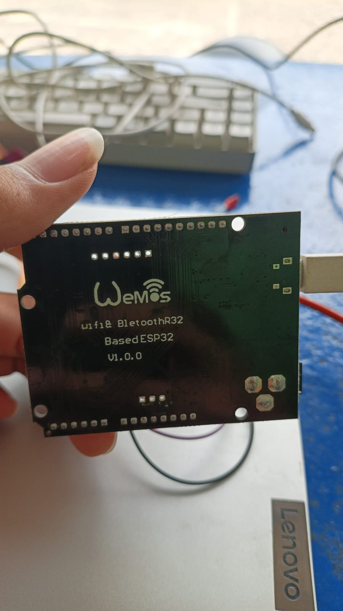
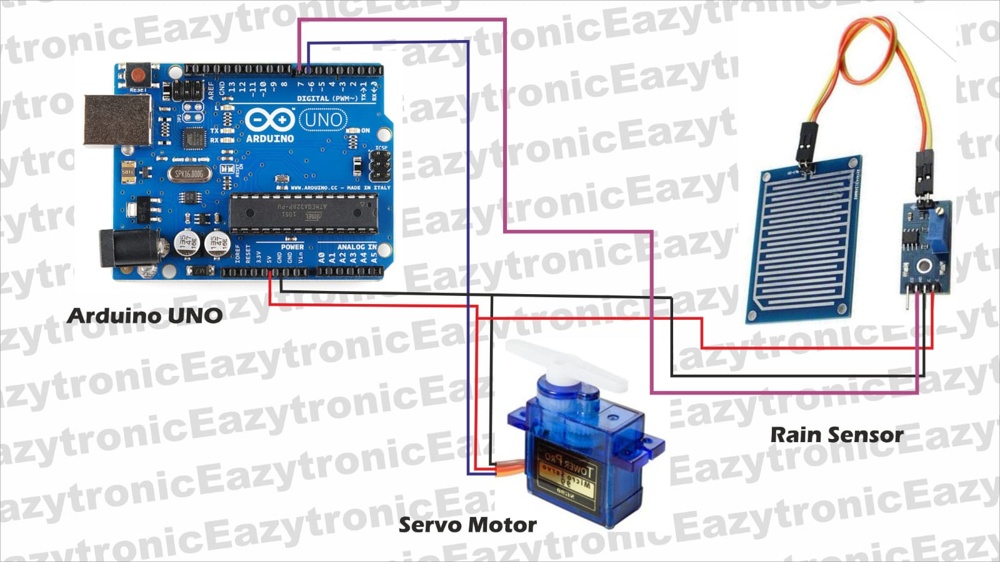

# 🌧️ Smart Home Outside (Jemuran Dan Lampu Teras) Berbasis ESP32 dan HTTP

> **Sistem Mikrokontroller – Kelompok 2**

---

## 📌 Judul Proyek
**Implementasi Smart Home Berbasis ESP32 dan HTTP dengan Sistem Jemuran Dan Lampu Teras Otomatis**

---

## 📖 Deskripsi Proyek

Proyek ini bertujuan untuk mengatasi masalah ketidakpastian cuaca, khususnya hujan mendadak, yang sering mengganggu proses penjemuran pakaian, serta otomatisasi lampu teras rumah. Dengan memanfaatkan teknologi **Internet of Things (IoT)**, sistem ini secara otomatis mendeteksi adanya tetesan air hujan dan menggerakkan jemuran ke area terlindung, serta mengatur lampu teras berdasarkan jadwal waktu.

Sistem dibangun menggunakan mikrokontroler **ESP32** yang terhubung ke **sensor hujan**, **motor servo** sebagai penggerak jemuran, dan **LED** sebagai lampu teras. Semua data dan kendali sistem dikomunikasikan melalui protokol **HTTP**, sehingga pengguna dapat memantau dan mengontrol rumah dari jarak jauh melalui dashboard web dashboard yang responsif.

---

## ⚙️ Cara Kerja Sistem

1. **Koneksi Wi-Fi:** ESP32 terhubung ke jaringan Wi-Fi agar bisa diakses lewat browser.
2. **Sinkronisasi Waktu:** Sistem otomatis mengambil data waktu (jam, menit, detik) dari browser pengguna secara berkala agar jadwal lampu tetap akurat.
3. **Kontrol Atap Jemuran:**
   * **Mode Otomatis:** Jika sensor terkena air hujan, servo akan otomatis bergerak menutup jemuran. Jika cuaca cerah kembali, servo akan otomatis membuka jemuran.
   * **Mode Manual:** Pengguna bisa bebas membuka atau menutup jemuran kapan saja melalui tombol di web dashboard.
4. **Kontrol Lampu Teras:**
   * **Mode Jadwal:** Lampu akan menyala dan mati secara otomatis sesuai dengan jam operasional yang telah diatur oleh pengguna di halaman web.
   * **Mode Manual:** Pengguna bisa menyalakan dan mematikan lampu secara langsung lewat tombol di web dashboard.

---

## 🧩 Komponen Proyek

### 🔧 Hardware & Pinout
1. **ESP32 DevKit V1** (Mikrokontroler Utama) |  
2. **Rain Drop Sensor** (Sensor Hujan) | 
3. **Servo SG90** (Penggerak Jemuran) 
4. **LED** (Lampu Teras)
5. **Kabel Jumper & Adaptor USB**

### 💻 Software
1. **Arduino IDE** (Untuk *programming* ESP32)
2. **Library ESP32Servo & WebServer**
3. **Web Dashboard** (HTML, CSS, JavaScript yang langsung ditanam di dalam kode ESP32)

---

## 📊 Pembagian Tugas Sistem (Multitasking)

Agar sistem berjalan lancar tanpa macet, program dibagi menjadi 3 tugas utama yang berjalan bersamaan:
* **Task Sensor:** Membaca sensor hujan setiap 200 milidetik dan menggerakkan servo.
* **Task Jadwal:** Memeriksa waktu setiap 1 detik untuk menyalakan/mematikan lampu sesuai jadwal.
* **Task Web:** Menangani request dan memperbarui tampilan data pada halaman web dashboard.

---

## 🚀 Fitur Utama

- ✅ **Dua Mode Kontrol:** Bisa diatur otomatis (pakai sensor/jadwal) atau manual (klik tombol di web).
- ✅ **Akurat Tanpa RTC:** Sinkronisasi waktu langsung menggunakan jam dari browser laptop/HP.
- ✅ **Dashboard Modern & Ringan:** Tampilan web bertema gelap (*Dark Mode*) yang informatif dan dilengkapi notifikasi *toast*.

---

## 👥 Anggota Kelompok
<ul>
    <li><strong>Muhammad Nizham Hibatullah</strong> (23552011241)</li>
    <li><strong>Sheva Nadhif Gazzauhar</strong> (23552011018)</li>
    <li><strong>Annisa Nur Fitriani</strong> (23552011192)</li>
</ul>
